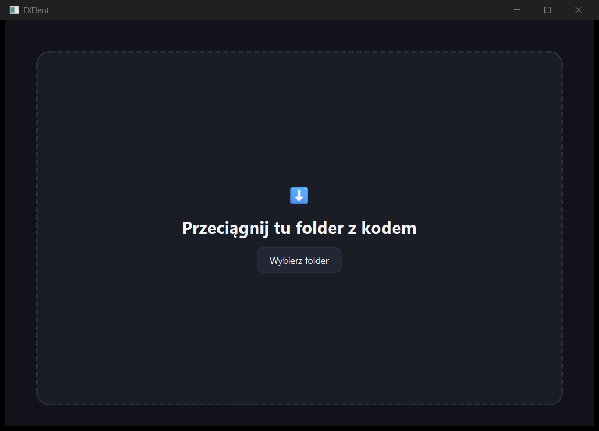

# EXElent

**Turn a folder of Python code into a Windows program you can hand to anyone.**

You point EXElent at a folder. It reads the code, works out how to start it,
and produces a single `.exe` file. The person you give that file to just
double-clicks it — they do not install Python, they do not open a terminal,
they do not have to know what any of this is.



*The interface follows your Windows language: Polish and English are both
built in.*

## Who this is for

You have some Python code — maybe you wrote it, maybe someone wrote it for
you, maybe it has been sitting on your disk for years — and you want to give
it to a person who will not install anything. That is the whole problem
EXElent solves.

You do not need to use a command line to use EXElent. It has a window.

Code kept in `.txt` files works too. That is common when the code was sent
over email or chat, and EXElent handles it without you renaming anything.

## Download and run

1. Go to the [releases page](https://github.com/exelent-app/exelent/releases/latest).
2. Download `EXElent.exe`.
3. Double-click it. There is nothing to install.

### Windows will probably warn you the first time

You will likely see a blue **"Windows protected your PC"** box. This happens
to every program that is not signed with a paid certificate, including this
one. Click **More info**, then **Run anyway**.

### Your antivirus may complain — about EXElent, or about what it makes

Antivirus software is suspicious of programs that bundle a Python interpreter
inside themselves, because some malware does the same thing. It is a guess
based on shape, not a detection of anything harmful, and it is a well-known
nuisance for every tool of this kind.

If it happens, you can add the file to your antivirus exceptions. EXElent does
not compress the programs it builds, specifically because compression makes
those false alarms more likely.

## What EXElent does to your folder

Nothing. It copies your code somewhere else and works on the copy, so the
folder you point it at is exactly as you left it — no new files, no `build`
or `dist` directories, nothing moved. The finished `.exe` is placed in a new
folder next to your project, or on your Desktop.

## Building it yourself

You only need this if you want to change EXElent or do not want to download a
binary. It requires Python and a command line.

```
pip install -e .[dev] pyinstaller==6.16.0
python build_exelent.py
```

The result is `dist/EXElent.exe`. To run the program from source without
packaging it:

```
python -m exelent
```

There is also a command-line entry point for the build logic alone, without
the window — it is a developer tool and speaks in error codes, not sentences:

```
python -m exelent.cli <folder>
```

To run the tests:

```
pytest -m "not slow"
```

The tests marked `slow` build real `.exe` files and take minutes.

## When something goes wrong

If a build fails, EXElent shows you what it thinks went wrong and offers two
buttons: one saves a report file, the other opens a prefilled bug report on
GitHub. Using that button is the most useful thing you can do, because the
report carries the log.

You can also open an issue by hand at
[github.com/exelent-app/exelent](https://github.com/exelent-app/exelent/issues).

## License

MIT — see [LICENSE](LICENSE). Do what you like with it.
